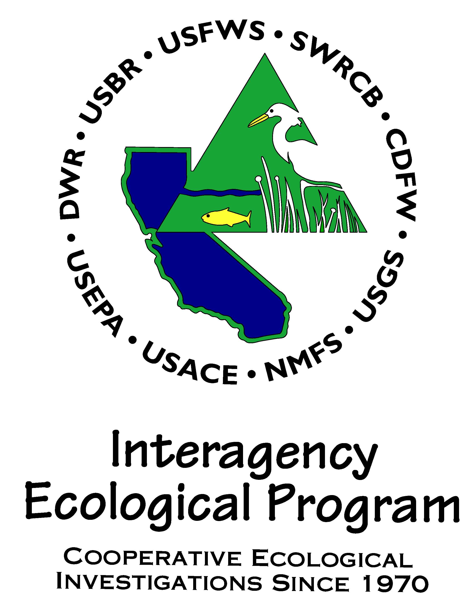
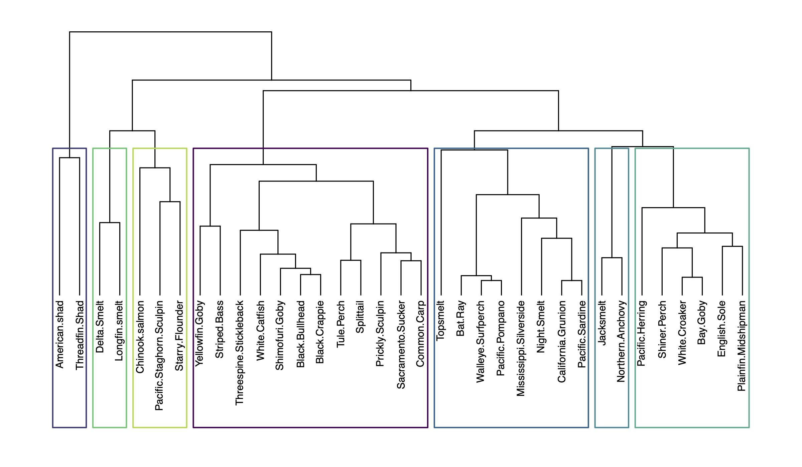

# IEP long-term monitoring review - 2020 pilot effort

  

## Code and analyses for identifying sub-community assemblages and representative species collected by IEP long-term monitoring surveys using midwater and otter trawl gears (Chapter 5)

NOTE: Data integration code and data (described in chapter 3) are
available in the [`LTMRdata`](https://github.com/sbashevkin/LTMRdata)
package. Additional IEP long-term monitoring review 2020 code can be [found here](https://github.com/sbashevkin/LTMRpilot).

**_Suggested chapter citation:_** Gaeta, JW and MP Beakes. _In Preparation_. Identifying Sub-Community Assemblages and Representative Species. **_In:_** IEP Long-term Survey Review Team. Interagency Ecological Program long-term survey designs to provide data relevant to community status and trends in the San Francisco Estuary: a pilot review of the Bay Study, UC Davis Suisun Marsh, and Fall Midwater Trawl Surveys, 2020. IEP Technical Report. p. 111-139.

**_Suggested full report citation:_** IEP Long-term Survey Review Team. _In Preparation_. Interagency Ecological Program long-term survey designs to provide data relevant to community status and trends in the San Francisco Estuary: a pilot review of the Bay Study, UC Davis Suisun Marsh, and Fall Midwater Trawl Surveys, 2020. IEP Technical Report. 

### Chapter Summary
  The long-term monitoring review team (Team) used a species clustering approach to identify candidate species from a >100 species pool to optimize the time and resources available to the Team for quantifying and synthesizing the effect of reduced sampling effort (via fewer stations, fewer events per year, or both) on our ability to understand the status and trends of individual species. This clustering approach enabled the Team to organize Bay Study, UC Davis Suisun Marsh Study, and Fall Midwater Trawl study trawl catch data into distinct groups (i.e., sub-community assemblages) of species. Trawl catch data, however, consist of species-specific catch at numerous stations sampled repeatedly for nearly forty years (i.e., repeated measures) and standard clustering approaches cannot take this spatial and temporal nature of the data into account while identifying species clustering. The Team used principal tensor analysis, which is an extension of traditional principal component analysis that can account for space and time, to identify species that were generally captured together across Bay Study midwater trawl and UC Davis otter trawl sample events. The Team then applied hierarchical agglomerative clustering to output from the principal tensor analysis to identify sub-community fish assemblages and determine the best representative among species in each cluster. 

### Code

- *data_comp_clean_agg.R*: Data compilation, filtering, and processing file
- *tensor_3D_open_water_year_round_station_season_level.R*: Open-water, year-round data grouping principal tensor and cluster analyses
- *tensor_3D_demersal_year_round_station_season_level.R*: Demersal, year-round data grouping principal tensor and cluster analyses
- *tensor_3D_open_water_fall_only_station_annual_level.R*: Open-water, fall-only data grouping principal tensor and cluster analyses

  

